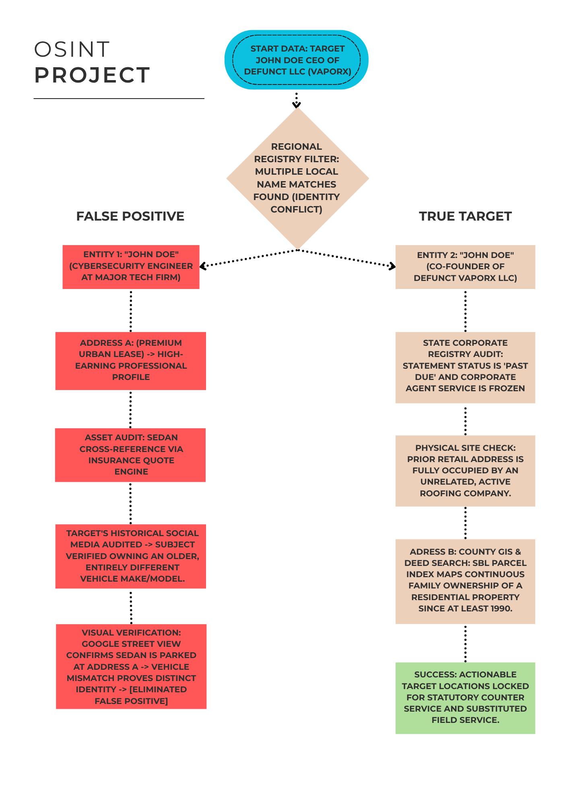

# OSINT Case Study: Entity Resolution and Service of Process Location
> **Subtitle:** A structural investigation to verify corporate standing, eliminate identity false positives, and establish verified residency anchors for individual and corporate service.

---

## Executive Summary
This case study documents a systematic, desk-based open-source intelligence (OSINT) investigation. The objective was to parse fragmented public data records to isolate an actionable, legally binding location for service of process regarding a historically abandoned domestic limited liability company (LLC) and its principal co-founder. 

Through disciplined link analysis and source verification, a major identity false positive was identified and mitigated, protecting the compliance integrity of the filing.

---

## Phase 1: Corporate Registry & Visual Footprint Audit
The investigation commenced with a single corporate data string identifying a boutique regional e-commerce brand: **"VaporX LLC."**

* **Filing Status vs. Operational Reality:** A baseline query of the State Department of State (DOS) Division of Corporations database revealed the entity status as legally "Active." However, a cross-reference of consumer-facing digital assets revealed a total freeze. The company's primary e-commerce domain was defunct, and the corporate social media footprint had completely ceased activity around August 2016.
* **Deduction:** The timeline aligned precisely with major structural changes in federal tobacco/vaping regulations, which forced the rapid market exit of boutique vendors. The entity was determined to be a **"Zombie LLC"**—operationally defunct but legally active due to a failure by the founders to file voluntary dissolution paperwork.
* **Target Identification:** Corporate filing records identified the primary operating owner/co-founder as **"Subject John Doe."**

---

## Phase 2: Resolving Regional Identity Conflicts ("The Cross-Reference Split")
A geographic filter applied to public registries returned an immediate bottleneck: multiple individuals named "John Doe" operating concurrently within the target metropolitan footprint. To prevent compliance violations and ensure data integrity, a rigorous subject deconfliction process was executed:

1. **Profile Isolation:** Public social data logs were audited. The target entrepreneur's profile confirmed a localized high school education baseline. Concurrently, a prominent professional profile surfaced for a separate "John Doe" in the area serving as a senior corporate cybersecurity engineer at a **Major Technology Firm**, with a prior background at a **Global Cyber Security Consult**.
2. **Asset Cross-Reference:** Real estate aggregate engines were utilized to audit a premium urban property address (**Address A**) linked by automated consumer data brokers to the target name. Current market-rate leases for the complex were verified at a premium tier, aligning with a high-earning corporate technology trajectory rather than a defunct boutique startup operator.
3. **The Automotive Asset Contradiction:** An audit of the target’s historical social media records verified past ownership of an older, specific vehicle make and model. Concurrently, a query of a public consumer insurance quote engine against the secondary cybersecurity profile revealed an active link to a modern ** mid-sized sedan**. Google Maps Street View imaging was deployed to audit the exterior of Address A, capturing the exact matching sedan parked on-site. 

**Conclusion:** The direct contradiction between the true target's documented vehicle history and the sedan linked to the urban address provided undeniable proof of distinct identity. This visual and financial evidence conclusively decoupled the corporate cybersecurity professional from the target investigation, successfully eliminating a high-risk false positive and confirming that the premium property was not owned or occupied by the target.

---

## Phase 3: Statutory Registry Workarounds & Agent Auditing
With the secondary corporate technology profile successfully filtered out, the investigation shifted back to locating the true principal of the defunct boutique venture.

* **Registered Agent Discrepancy:** The DOS filing listed the corporate process address as *"C/O National Corporate Agent Registry Service."* Because the company’s corporate statement status was explicitly flagged by the state as **"Past Due,"** it was deduced that the annual subscription fee for this third-party statutory agent had been delinquent for years, rendering this delivery route non-functional.
* **The On-Site Check:** A physical address previously tied to the retail operation was cross-checked against current commercial listings. The location was verified to be entirely occupied by an unrelated, active roofing company, proving complete corporate relocation.
* **Actionable Legal Resolution:** Due to the "Past Due" compliance failure of the LLC, the legal framework under state statutory service laws was triggered. A strategy was codified to execute *Statutory Service* by bypassing the defunct physical fronts entirely and serving copies of the legal summons directly to the Department of State Clerk counter at the state capital to secure an ironclad court filing.

---

## Phase 4: Property Chain of Title & Multi-Generational Anchor Identification
To provide a comprehensive field option alongside the statutory route, an open-source property title search was conducted to find a primary residential anchor.

* **Methodology:** Moving outside automated city databases, direct access was gained to the regional land records lookup system. A Section-Block-Lot (SBL) parcel search was executed to track historical deed records.
* **The Anchor Discovery:** A final property node was audited: **Address B** (a single-family residence outside the main city center). Public GIS mapping and assessor tax cards revealed the property had been purchased since the **1990s** and remained under the continuous ownership of two immediate family members sharing the subject's last name for three decades.
* **Result:** While the subject's status as an off-deed tenant or renter shields his name from public land titles, isolating this long-standing, 30-year multi-generational family household provided a verified **"Usual Place of Abode."** This unlocked the legal pathway to execute secure **Substituted Service** via an adult co-resident family member.

---

## Phase 5: Investigation Link Analysis

---

## Final Investigative Summary
Using entirely **Open Source Intelligence (OSINT)** and zero-cost digital workarounds, this case file successfully achieved:
1. The complete structural breakdown of an abandoned corporate entity.
2. The absolute mitigation of a high-profile identity false positive.
3. The discovery of a 30-year family residential anchor for field execution.
4. The mapping of a definitive statutory legal workaround via the Secretary of State.

***
*Disclaimer: All sensitive entities, specific geolocations, and proprietary assets within this case study have been thoroughly altered or redacted and anonymized to preserve operational security and adhere to strict privacy compliance benchmarks.*

